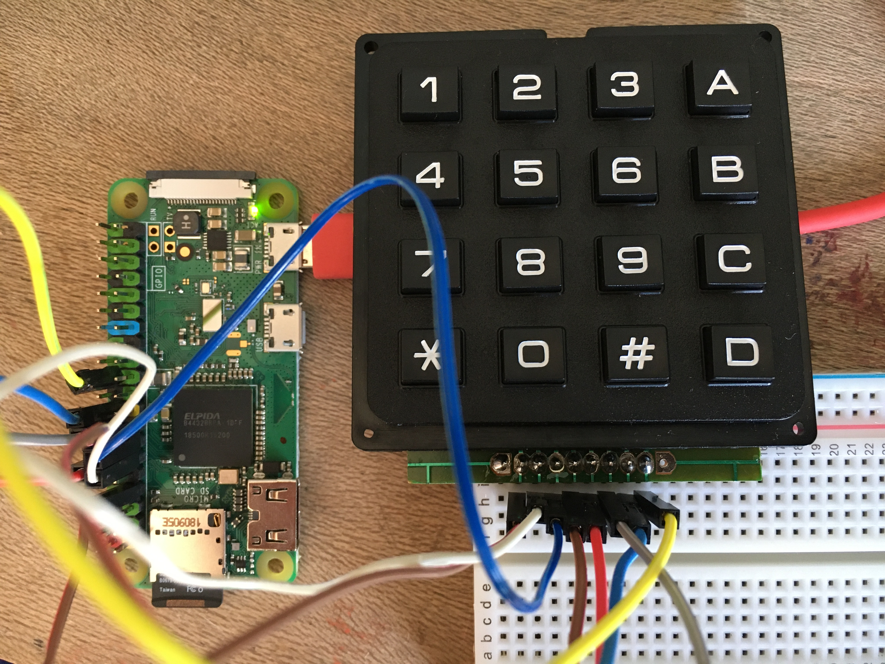

# Keypad

A Go library to use 4x4 keypads with the Raspberry Pi, e.g. https://www.sparkfun.com/products/14881



## Example usage

```go
err := rpio.Open()
if err != nil {
  fmt.Printf("error: %v\n", err)
  os.Exit(1)
}
defer rpio.Close()

// See https://pinout.xyz to select pins.
p1 := rpio.Pin(4)
p2 := rpio.Pin(17)
p3 := rpio.Pin(27)
p4 := rpio.Pin(22)
p5 := rpio.Pin(18)
p6 := rpio.Pin(23)
p7 := rpio.Pin(24)
p8 := rpio.Pin(25)

pad := keypad.New(p1, p2, p3, p4, p5, p6, p7, p8)
for {
  if keys, ok := pad.Read(); ok {
    for _, e := range keys {
      fmt.Printf("Key: %+v\n", e)
    }
  }
}
```

Output:

```
Key: C
Key: #
Key: A
Key: D
Key: 6
Key: C
Key: 7
Key: 8
Key: 9
Key: 9
Key: 9
Key: 9
```